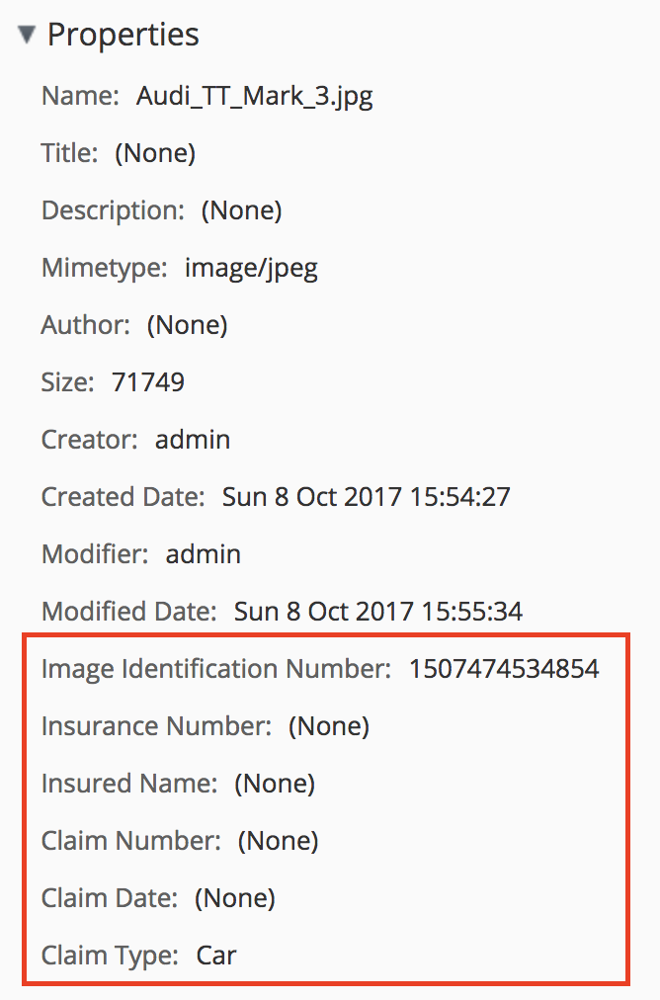

# Welcome

This demo builds upon the [Firehose Rekognition demo](https://github.com/gavincornwell/firehose-rekognition-demo) where events emitted from [Alfresco](https://www.alfresco.com) are sent to AWS [Kinesis Firehose](https://aws.amazon.com/kinesis/firehose).

Rather than using one large Lambda function to process uploaded images this demo orchestrates several smaller Lambda functions using Step Functions.

# Use Case

The demo uses a fictional use case around an insurance company. As images or text files are uploaded into the system they are sent asynchronously to Rekognition or Comprehend for analysis, the content type of the node is changed to an appropriate [custom type](https://github.com/gavincornwell/firehose-extension/blob/master/firehose-extension-platform-jar/src/main/resources/alfresco/module/firehose-extension-platform-jar/model/content-model.xml) (```acme:insuranceClaimImage``` or ```acme:insuranceClaimReport```) and a unique ID generated.

If an image is detected Rekognition is used to look for a Cars, Motorcycles, Boats, Electronics, Jewelry, Wristwatches, Clocks, Bicycles, Sport Equipment and Furniture. If detected, the ```acme:claimType``` property is set appropriately otherwise the default value of "Unknown" is used.

If a text file is detected Comprehend is used to look for the claim adjusters name and the date and location of the visit within the text. The sentiment of the text is also analysed to determine whether a follow up visit is likely to be required. The extracted values are set on the ```acme:claimAdjuster```, ```acme:visitDate```, ```acme:visitLocation``` and ```acme:visitFollowUp``` properties, respectively.

The architecture for this is shown in the diagram below:


# Prerequisites

To run this demo some familiarity with Alfresco and AWS is presumed.

The [AWS CLI](http://docs.aws.amazon.com/cli/latest/userguide/installing.html) needs to be present, configured with a valid access ID/key and configured to use either the North Virginia (us-east-1), Oregon (us-west-2) or Ireland (eu-west-1) region.

An S3 bucket and an EC2 KeyPair created in the same region in which the demo will be run.

Access to the AWS console.

# Package & Deploy

Run the ```deploy``` script passing the name of an S3 bucket to upload the code to, the name of the stack to create and the name of the key pair to use, for example:

```bash
deploy demo-code-deployments my-stack-name my-key-pair
```

After a short while you'll see the stack appear in the AWS [CloudFormation Console](https://console.aws.amazon.com/cloudformation/home), you can track progress of the stack creation there.

Once the stack is complete select the "Outputs" tab (shown in the screenshot below) to see all the information you'll need for accessing the system.


NOTE: It will take about 10 minutes for the Alfresco Repository to be ready for use.

# Demo

Click on the link for the "ShareUrl" key shown in the CloudFormation "Outputs" tab. Login using the values of the "RepoUserName" and "RepoPassword" outputs and create a site.

## Handling Images

Upload a few pictures, in the example shown below I've chosen an image that contains a car, one that contains a bicycle and the Alfresco logo.


It will take a couple of minutes for the events to make their way through the Kinesis Firehose stream (it [buffers data](http://docs.aws.amazon.com/firehose/latest/dev/create-configure.html), the minimum interval is 1 minute), get processed by the state machine and prompt the update of the images metadata.

Visit the [Step Functions](https://console.aws.amazon.com/states/home) console and click on the state machine, you should see a list of successful executions. Clicking on an execution result should show something similar to the screenshot below:


The "Execution Details" on the right side of the console shows information on the execution including the input and output (shown below), this can be really useful for monitoring debugging when things go wrong.


The bottom half of the console shows the steps the state machine took and links to the logs of the Lambda functions called during the execution, clicking the CloudWatch Logs link of the ```ProcessImage``` function shows an output similar to the one shown below:


The last step in the state machine is to update the metadata by calling the Alfresco REST API.

Go back to Share, navigate to the folder where you uploaded the images and click on the image containing the car. Examine the properties of the image and you'll see it's type has been changed to ```acme:insuranceClaimImage``` as the custom properties are present as shown in the screenshot below:



A unique ID has been generated for the ```acme:imageId``` property and the ```acme:claimType``` property has been set appropriately.

A similar thing has happened to the image of the bicycle and the logo, the ```acme:claimType``` property will be set to "Bicycle" and "Unknown", respectively.

## Handling Text

Create a new text file named report.txt in the site created earlier with the following content (see screenshot below):

    My name is Joe Bloggs​, I visited 123 Acme Street, London on December 16, 2017. I'm pleased to confirm that this is a valid claim.


Once the new file has been processed by Kinesis Firehose the same Step Function will have been called, go back to the [console]((https://console.aws.amazon.com/states/home)). Clicking on the latest execution result should show something similar to the screenshot below:


As before, look at the "Execution Details" on the right side of the console to see the input and output (shown below):


As a text file was detected by the Step Function the ```ProcessText``` Lambda function was called this time, clicking on the CloudWatch Logs link in the lower part of the console shows what Comprehend returned:


The last step in the state machine is to update the metadata by calling the Alfresco REST API, this can be verified by going back to Share and examining the properties of the text file created earlier. The type should now be ```acme:insuranceClaimReport``` and the properties set as shown below:


# Troubleshooting

The [AMI used](https://aws.amazon.com/marketplace/pp/B06XHK6MNR?qid=1505364260789&sr=0-2&ref_=srh_res_product_title) by the CloudFormation stack is a 5.2 Enterprise Server, as such a trial license will be generated. Once your stack is over 30 days old the repository will go into read-only mode. If this happens either apply a valid license or re-create the stack.

If you need to SSH to the EC2 instance use <code>centos@&lt;public-ip&gt;</code>. You can get the public-ip from any of the URLs output by the CloudFormation template. Also, remember to use the SSH key selected when creating the stack!

The log files for the Repository and Share are located in ```/var/log/tomcat-alfresco``` and ```/var/log/tomcat-share```, respectively. 

To see the events being processed on the repository add the following debug statements to ```/usr/share/tomcat/shared/classes/alfresco/log4j.properties```:

    log4j.logger.org.alfresco.messaging.camel.routes.KinesisFirehoseRouteBuilder=debug
    log4j.logger.org.apache.camel.component.aws=debug
    log4j.logger.com.amazonaws.request=debug

Further configuration (including the name of the target Firehose stream) can be made in ```/usr/share/tomcat/shared/classes/alfresco-global.properties```.

If you make any configuration changes you'll need to restart the Repository or Share Tomcat service, using ```service tomcat-alfresco restart``` or ```service tomcat-share restart```, respectively. Note: you'll need to ```sudo su``` first.

To check that events are being emitted you can also examine the ActiveMQ admin console using the ```ActiveMQUrl``` output by the CloudFormation template. You should see the number highlighted in the screenshot below increasing after activity in Share.


If you're still having problems feel free to raise an [issue](https://github.com/gavincornwell/firehose-step-functions-demo/issues).

# Cleanup

When you're finished with the stack (you will be charged a small amount for the resources it uses) navigate to the CloudFormation console, select the stack you created and choose "Delete Stack" from the "Actions" menu.